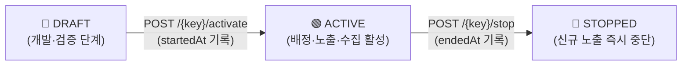

# 🧪 Dayuse A/B 실험 운영 가이드

Dayuse에서 가설을 세우고 **실험 등록 → 화면 연동 → 활성화 → 성과(CVR) 비교 → 종료 및 코드 정리**까지 진행하는 전체 운영 매뉴얼입니다.

---

## 📑 목차
1. [핵심 개념 3가지](#1-핵심-개념-3가지)
2. [실험 생명주기와 상태별 동작](#2-실험-생명주기와-상태별-동작)
3. [단계별 실험 진행 가이드 (Step 1 ~ 5)](#3-단계별-실험-진행-가이드-step-1--5)
4. [API 레퍼런스](#4-api-레퍼런스)
5. [로컬 5분 실습 (Quickstart)](#5-로컬-5분-실습-quickstart)
6. [자주 묻는 질문 & 트러블슈팅](#6-자주-묻는-질문--트러블슈팅)

---

## 1. 핵심 개념 3가지

Dayuse의 실험 시스템은 **`experiments` (실험 정의)** 와 **`product_events` (노출·전환 이벤트)** 두 테이블만으로 동작합니다.

| 구분 | 개념 | 설명 |
| :--- | :--- | :--- |
| **① 배정 (Assignment)** | `SHA-256(experimentKey:userId:salt) % 100` | DB에 배정 결과를 저장하지 않고 **매 요청마다 결정론적 해시로 계산**합니다.<br>새로고침·재로그인·다중 서버 환경에서도 같은 유저는 언제나 100% 동일한 Variant(`A` 또는 `B`)를 받습니다. |
| **② 노출 (Exposure)** | `experiment_exposed` 이벤트 | 단순히 배정 계산만 된 시점이 아니라, **사용자가 실험 대상 화면에 실제로 진입해 UI가 렌더링된 순간** 기록됩니다. (**CVR의 분모**) |
| **③ 전환 (Conversion)** | 목표 행동 이벤트 (예: `challenge_joined`) | 실험 UI에 노출된 사용자가 **최초 노출 시각 이후에 목표 행동을 완료한 것**입니다. (**CVR의 분자**) |

> [!IMPORTANT]
> **왜 별도의 배정 테이블(`experiment_assignments`)을 두지 않나요?**
> - 점진적 기능 배포용 Feature Flag(`feature_assignments`)는 롤아웃 비율을 조정해도 기존 사용자의 UI가 바뀌면 안 되므로 DB에 저장합니다.
> - 반면 **A/B 실험(`Experiment`)** 은 결정론적 해시만으로 활성 기간 중 일관된 Variant가 보장되며, 실험 종료(`STOPPED`) 시 전원 즉시 기본 경험(`A`)으로 돌아가야 하므로 별도 배정 테이블이 필요 없습니다.

---

## 2. 실험 생명주기와 상태별 동작

실험 상태는 **`DRAFT` → `ACTIVE` → `STOPPED` 단방향**으로만 전이됩니다.



### 상태별 시스템 동작 및 Fallback 규칙

실험이 비활성 상태이거나 장애가 발생하더라도 **핵심 비즈니스 기능(챌린지 참여·인증 등)은 절대 중단되지 않으며**, 항상 기본 경험(`Variant A`)을 반환합니다.

| 실험 상태 / 상황 | 사용자에게 노출되는 화면 | `participating` | `fallbackReason` | `experiment_exposed` 기록 |
| :--- | :--- | :---: | :---: | :---: |
| **`DRAFT`** (시작 전) | 기본 경험 (`A`) | `false` | `INACTIVE_DRAFT` | ❌ 미기록 |
| **`ACTIVE`** (`rollout = 0%`) | 기본 경험 (`A`) | `false` | `ROLLOUT_DISABLED` | ❌ 미기록 |
| **`ACTIVE`** (Rollout 버킷 미포함) | 기본 경험 (`A`) | `false` | `NONE` | ❌ 미기록 |
| **`ACTIVE`** (Rollout 버킷 포함) | **배정된 Variant (`A` 또는 `B`)** | **`true`** | `NONE` | **✅ 실제 렌더링 시 1회 기록** |
| **`STOPPED`** (실험 종료) | 기본 경험 (`A`) | `false` | `INACTIVE_STOPPED` | ❌ 미기록 |
| **미등록 키 / DB 조회 오류** | 기본 경험 (`A`) | `false` | `NOT_FOUND` / `ERROR` | ❌ 미기록 |

### 도메인 안전 제약조건
- **종료된 실험 재활성화 금지 (`STOPPED` ↛ `ACTIVE`)**: 과거에 수집된 데이터와 새 조건의 데이터가 같은 `experimentKey`에 섞이는 것을 막기 위해 재활성화를 차단합니다. 조건을 바꾸려면 새 버전 키(`-v2`)를 발급하세요.
- **진행 중 A/B 비율 변경 금지**: `ACTIVE` 상태에서 `variantRatio`를 바꾸면 기간별 표본 비율이 왜곡(Sample Ratio Mismatch)되므로 `DRAFT` 상태에서만 변경할 수 있습니다.
- **Rollout 비율 조정을 통한 무중단 제어**: `rolloutPercentage`(`0 ~ 100`)는 `ACTIVE` 상태에서도 변경할 수 있습니다.

---

## 3. 단계별 실험 진행 가이드 (Step 1 ~ 5)

### Step 1. 실험 정의 등록 (`DRAFT`)

[`DayuseExperimentDefinitions.kt`](../backend/src/main/kotlin/com/dayuse/domain/experiment/DayuseExperimentDefinitions.kt)의 `SEEDS` 목록에 실험을 추가하면, 서버 기동 시 [`ExperimentSeeder`](../backend/src/main/kotlin/com/dayuse/domain/experiment/service/ExperimentSeeder.kt)가 `DRAFT` 상태로 자동 등록합니다.

```kotlin
ExperimentCreateRequest(
    experimentKey = "challenge-invite-copy-v1", // 영문 소문자·숫자·하이픈 (불변 식별자)
    name = "챌린지 참여 화면 초대 문구 실험",
    rolloutPercentage = 100,                    // 전체 사용자 중 실험에 포함할 비율 (0~100%)
    variantARatio = 50,                         // 실험 참여자 내 Control(A) 비율
    variantBRatio = 50                          // 실험 참여자 내 Treatment(B) 비율 (A+B = 100)
)
```

- 이미 DB에 동일한 `experimentKey`가 존재하면 **절대 덮어쓰지 않습니다** (운영 중인 `ACTIVE` 실험이 재배포 시 `DRAFT`로 초기화되는 사고 방지).
- API(`POST /api/v1/experiments`)로 직접 등록할 수도 있습니다.

---

### Step 2. 프론트엔드 화면 연동

실험 대상 컴포넌트 내부에서 [`useExperiment`](../frontend/src/hooks/useExperiment.ts), [`useExperimentExposure`](../frontend/src/hooks/useExperimentExposure.ts), [`track`](../frontend/src/utils/tracker.ts) 3가지를 연결합니다.

```tsx
// 1) 현재 사용자의 Variant 조회 (모달/화면이 열릴 때 활성화)
const experiment = useExperiment(CHALLENGE_INVITE_COPY_EXPERIMENT, isOpen);
const copy = resolveChallengeInviteCopy(experiment);

// 2) 실험 문구가 실제로 화면에 렌더링된 시점에만 Exposure(experiment_exposed) 자동 기록
useExperimentExposure(experiment, isOpen && !loading && preview !== null);

// 3) Variant 확정 전(isReady=false)에는 높이만 유지해 A → B 깜빡임(Flicker) 방지
<div className="min-h-10">
  {experiment.isReady && <span>{copy}</span>}
</div>

// 4) 전환 행동(Conversion) 발생 시 3번째 인자로 experiment 전달
//    -> 실제 실험 참여자(participating=true)일 때만 properties.experiment가 자동 주입됨
track('challenge_joined', { challengeId }, experiment);
```

> [!TIP]
> **프론트엔드 연동 체크리스트**
> 1. **단일 변인 통제**: 실험 문구 외에 버튼 색상·레이아웃 등 다른 요소를 동시에 바꾸지 마세요.
> 2. **Flicker 방지**: `experiment.isReady`가 `true`가 될 때까지 실험 텍스트 노출을 보류해 `A` 문구가 잠깐 보였다가 `B`로 바뀌는 현상을 막으세요.
> 3. **비참여자 오염 방지**: `useExperimentExposure`와 `track(..., experiment)`는 내부적으로 `participating === true && !isFallback`을 검사하므로 미참여자의 이벤트는 자동으로 필터링됩니다.

---

### Step 3. 실험 시작 (`DRAFT` → `ACTIVE`)

배포 시점에 실험이 자동으로 켜지지 않도록 **운영자가 직접 API를 호출해 시작**합니다. 호출 즉시 `startedAt` 시각이 기록됩니다.

```bash
curl -X POST http://localhost:8080/api/v1/experiments/challenge-invite-copy-v1/activate \
  -H "Authorization: Bearer $TOKEN"
```

---

### Step 4. 성과 비교 및 CVR 확인 (`GET /results`)

충분한 표본이 모이면 목표 전환 이벤트(`conversionEventName`)를 기준으로 Variant `A`와 `B`의 성과를 조회합니다.

```bash
curl "http://localhost:8080/api/v1/experiments/challenge-invite-copy-v1/results?conversionEventName=challenge_joined" \
  -H "Authorization: Bearer $TOKEN"
```

#### 응답 예시
```json
{
  "experimentKey": "challenge-invite-copy-v1",
  "name": "챌린지 참여 화면 초대 문구 실험",
  "status": "ACTIVE",
  "rolloutPercentage": 100,
  "variantRatio": { "a": 50, "b": 50 },
  "conversionEventName": "challenge_joined",
  "startedAt": "2026-10-01T09:00:00",
  "endedAt": null,
  "totalExposedUsers": 120,
  "totalConvertedUsers": 42,
  "overallCvr": 35.0,
  "variants": [
    {
      "variant": "A",
      "exposedUsers": 60,
      "exposureEvents": 85,
      "convertedUsers": 18,
      "conversionEvents": 20,
      "cvr": 30.0
    },
    {
      "variant": "B",
      "exposedUsers": 60,
      "exposureEvents": 91,
      "convertedUsers": 24,
      "conversionEvents": 27,
      "cvr": 40.0
    }
  ]
}
```

#### CVR 산출 규칙 ([`ExperimentConversionCalculator.kt`](../backend/src/main/kotlin/com/dayuse/domain/experiment/ExperimentConversionCalculator.kt))
$$\text{CVR}(\%) = \frac{\text{노출 이후 전환에 도달한 고유 사용자 수 (convertedUsers)}}{\text{실제 노출된 고유 사용자 수 (exposedUsers)}} \times 100$$

- **고유 사용자(Unique Users) 기준**: 한 사용자가 화면을 10번 새로고침(`exposureEvents = 10`)하고 챌린지 참여를 3번 발생(`conversionEvents = 3`)시켜도 사용자 수에는 **1명(`exposedUsers = 1`, `convertedUsers = 1`)** 으로만 집계됩니다.
- **비노출·사전 전환 제외**: `experiment_exposed` 기록이 없는 사용자나, 최초 노출 시각(`firstExposedAt`) **이전에** 발생한 전환 이벤트는 집계에서 제외됩니다.

---

### Step 5. 실험 종료 (`STOPPED`) 및 코드 정리

승자 Variant가 결정되면 실험을 종료하고 코드에서 실험 분기를 정리합니다.

```bash
curl -X POST http://localhost:8080/api/v1/experiments/challenge-invite-copy-v1/stop \
  -H "Authorization: Bearer $TOKEN"
```

1. **즉시 노출 중단 & 데이터 보존**: `stop` 호출 즉시 모든 사용자는 기본 경험(`A`)을 보게 되며, 기존 `product_events` 데이터는 삭제되지 않아 종료 후에도 `/results`를 언제든 다시 조회할 수 있습니다.
2. **승자 코드 승격 및 분기 제거**:
   - 채택된 Variant의 문구/UI를 기본 상수로 반영합니다.
   - 컴포넌트에서 `useExperiment`, `useExperimentExposure` 호출을 제거합니다.
   - `DayuseExperimentDefinitions.SEEDS`에서 종료된 실험 시드를 제거합니다.

---

## 4. API 레퍼런스

기본 경로는 `/api/v1/experiments` (또는 `/api/experiments`)입니다.

### 사용자용 API (로그인 사용자 누구나 호출 가능)

| 메서드 | 경로 | 설명 |
| :---: | :--- | :--- |
| `GET` | `/{experimentKey}/assignment` | 현재 로그인 사용자의 Variant 배정 결과 조회 (`participating`, `variant`, `isFallback`) |
| `GET` | `/assignments?keys=exp1,exp2` | 활성 실험 전체(또는 지정한 키 목록)에 대한 내 배정 결과 일괄 조회 |
| `GET` | `/{experimentKey}/fallback` | 실험 상태에 따른 Fallback 판정 조회 |

### 운영자용 API (`AnalyticsAccessGuard` 적용)

> [!IMPORTANT]
> **운영자 식별 및 서버 설정 방법 (`ANALYTICS_ADMIN_USER_IDS`)**
> - 서버 `.env`에는 만료되는 JWT 토큰이 아니라 **본인 계정의 고정 `users.id` 숫자(예: `1`)** 를 등록합니다.
>   ```env
>   # Oracle Cloud 서버 ~/dayuse/.env
>   ANALYTICS_ADMIN_USER_IDS=1
>   ```
> - **운영(`prod`) 프로필**: `ANALYTICS_ADMIN_USER_IDS`가 비어 있으면 **전원 `403 Forbidden`으로 차단(Fail-Closed)** 됩니다. 등록된 `userId`의 로그인 토큰(`Authorization: Bearer $TOKEN`)으로 요청할 때만 통과합니다.
> - **로컬(`local`)/테스트(`test`) 프로필**: 개발 편의를 위해 비어 있으면 로그인한 모든 사용자를 허용합니다.

| 메서드 | 경로 | 설명 |
| :---: | :--- | :--- |
| `POST` | `/` | 신규 실험 생성 (`DRAFT` 상태) |
| `GET` | `/?status=ACTIVE` | 실험 목록 조회 (`status` 필터 선택) |
| `GET` | `/{experimentKey}` | 실험 상세 설정 조회 |
| `POST` / `PATCH` | `/{experimentKey}/activate` | 실험 활성화 (`DRAFT` → `ACTIVE`, `startedAt` 기록) |
| `POST` / `PATCH` | `/{experimentKey}/stop` | 실험 종료 (`ACTIVE` → `STOPPED`, `endedAt` 기록) |
| `PATCH` | `/{experimentKey}/rollout` | Rollout 비율(`0~100`) 변경 (`{"rolloutPercentage": 50}`) |
| `PATCH` | `/{experimentKey}/variant-ratio` | A/B 비율 변경 (`DRAFT` 상태에서만 가능) |
| `GET` | `/{experimentKey}/results` | Variant별 노출·전환·CVR 비교 조회 (`?conversionEventName=challenge_joined`) |

---

## 5. 로컬 5분 실습 (Quickstart)

MySQL과 백엔드 서버가 실행 중인 상태에서 터미널만으로 전체 사이클을 즉시 테스트할 수 있습니다.

### 1) 테스트용 JWT 토큰 발급
```bash
TOKEN=$(curl -s -X POST http://localhost:8080/api/v1/auth/kakao \
  -H 'Content-Type: application/json' \
  -d '{"code":"mock-77"}' \
  | python3 -c "import sys,json; print(json.load(sys.stdin)['accessToken'])")
```

### 2) 실험 활성화 및 내 배정 Variant 확인
```bash
# 실험 시작 (DRAFT -> ACTIVE)
curl -s -X POST http://localhost:8080/api/v1/experiments/challenge-invite-copy-v1/activate \
  -H "Authorization: Bearer $TOKEN"

# 내 배정 결과 확인 (participating=true, variant="A" 또는 "B")
curl -s http://localhost:8080/api/v1/experiments/challenge-invite-copy-v1/assignment \
  -H "Authorization: Bearer $TOKEN"
```

### 3) 노출(`experiment_exposed`) 및 전환(`challenge_joined`) 이벤트 전송
```bash
# 1. 노출 이벤트 기록
curl -s -X POST http://localhost:8080/api/v1/events \
  -H "Authorization: Bearer $TOKEN" \
  -H "Content-Type: application/json" \
  -d '{
    "eventId": "local-exp-001",
    "eventName": "experiment_exposed",
    "occurredAt": "2026-10-01T09:10:00.000+09:00",
    "sessionId": "sess-local-1",
    "schemaVersion": 1,
    "appVersion": "0.10.0",
    "properties": {
      "experimentKey": "challenge-invite-copy-v1",
      "variant": "B"
    }
  }'

# 2. 전환 이벤트 기록 (Experiment Context 포함)
curl -s -X POST http://localhost:8080/api/v1/events \
  -H "Authorization: Bearer $TOKEN" \
  -H "Content-Type: application/json" \
  -d '{
    "eventId": "local-conv-001",
    "eventName": "challenge_joined",
    "occurredAt": "2026-10-01T09:11:00.000+09:00",
    "sessionId": "sess-local-1",
    "schemaVersion": 1,
    "appVersion": "0.10.0",
    "properties": {
      "challengeId": 1,
      "experiment": {
        "experimentKey": "challenge-invite-copy-v1",
        "variant": "B"
      }
    }
  }'
```

### 4) Variant별 CVR 결과 조회
```bash
curl -s "http://localhost:8080/api/v1/experiments/challenge-invite-copy-v1/results?conversionEventName=challenge_joined" \
  -H "Authorization: Bearer $TOKEN"
```

---

## 6. 자주 묻는 질문 & 트러블슈팅

| 증상 | 원인 | 해결 방법 |
| :--- | :--- | :--- |
| **항상 Variant `A`만 나와요** | 1) 실험이 아직 `DRAFT` 또는 `STOPPED` 상태임<br>2) 현재 로그인한 계정이 해시 버킷상 `A`에 배정됨 | • `GET /{key}/assignment` 응답의 `fallbackReason` 확인 (`INACTIVE_DRAFT`면 `activate` 호출)<br>• 다른 테스트 계정(`mock-78`, `mock-79` 등)으로 로그인해 확인 |
| **`experiment_exposed`가 안 쌓여요** | 1) 실험 미참여(`participating: false`) 상태임<br>2) 현재 브라우저 세션에서 이미 1회 기록됨 | • 세션당 1회만 발화하므로 새 시크릿 창을 열거나 `sessionStorage`를 비운 뒤 재진입 |
| **전환 이벤트를 보냈는데 CVR이 `0%`예요** | 1) 해당 유저의 `experiment_exposed` 기록이 없음<br>2) 전환 시각(`occurredAt`)이 최초 노출 시각보다 빠름 | • 반드시 `experiment_exposed`가 먼저 기록된 이후 시각의 전환 이벤트여야 집계됨 |
| **같은 이벤트를 다시 보냈는데 개수가 안 늘어요** | 정상 동작 (`eventId` 기준 멱등성 보장) | • 동일한 `eventId`는 중복 저장되지 않음 (`200 OK`, `duplicated: true`). 새 테스트 시에는 `eventId`를 변경 |
| **`activate` 호출 시 `400 Bad Request`가 나요** | 이미 `ACTIVE` 상태이거나 종료된(`STOPPED`) 실험임 | • 종료된 실험은 재활성화할 수 없으므로 새 버전 키(`-v2`)로 실험 생성 |
